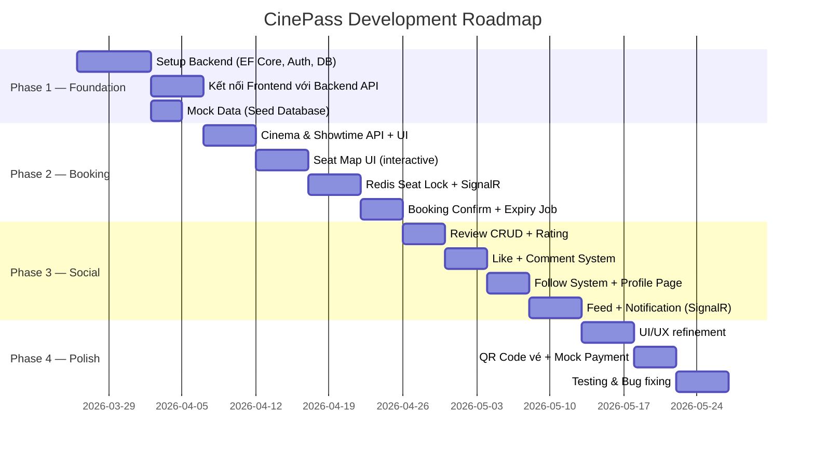

# 🎬 CinePass — Kế Hoạch Cập Nhật Dự Án

## Tổng quan hiện trạng

| Thành phần | Công nghệ | Trạng thái |
|---|---|---|
| **Frontend** | React 19 + Vite + TailwindCSS v4 + React Router v7 + **Zustand** | Đang hoạt động (UI + mock TMDB API) |
| **Backend** | ASP.NET Core 8 Minimal API | Chỉ có boilerplate mặc định |
| **Database** | **MySQL 8** (EF Core + Pomelo) | Chưa có |
| **Movie Data** | **TMDB API** (seed mock data) | — |
| **Auth** | JWT Bearer | Chưa có |
| **Realtime** | SignalR | Chưa có |
| **Payment** | VNPay / MoMo *(tích hợp sau)* | — |

**Mục tiêu**: Kết hợp frontend hiện tại với backend đầy đủ, xây dựng 2 module chính:
1. **Cinema Booking** — Chọn phim → chọn rạp/suất chiếu → đặt vé, chọn ghế
2. **Social Mini** — Review phim, comment, like, follow người dùng

---

## 🏗️ Kiến trúc đề xuất

```
┌─────────────────────────────────────────────────────────┐
│                      CinePass                           │
├──────────────────────┬──────────────────────────────────┤
│   Frontend           │   Backend (ASP.NET Core 8)       │
│   React + Vite       │                                  │
│   TailwindCSS v4     │  ┌─────────────────────────┐    │
│   React Router v7    │  │  REST API (Controllers) │    │
│   Axios / SWR        │  │  + SignalR Hubs          │    │
│                      │  └────────────┬────────────┘    │
│   Zustand (state)    │               │                  │
│   SignalR client     │  ┌────────────▼────────────┐    │
│                      │  │  Service Layer          │    │
└──────────────────────┘  │  + Repository Pattern   │    │
                          └────────────┬────────────┘    │
                          ┌────────────▼────────────┐    │
                          │  PostgreSQL (EF Core)   │    │
                          │  Redis (seat locking)   │    │
                          └─────────────────────────┘    │
└─────────────────────────────────────────────────────────┘
```

> [!NOTE]
> **Tại sao tích hợp thay vì tách biệt?** Backend và Frontend cùng repo, dễ deploy, phù hợp scale nhỏ-vừa. Sau này nếu cần có thể tách ra micro-service.

---

## 🗄️ Database Design (Mở rộng & Tối ưu)

### 1. User & Auth

```sql
Users
  - Id            UUID (PK)
  - Username      VARCHAR(50) UNIQUE NOT NULL
  - Email         VARCHAR(100) UNIQUE NOT NULL
  - PasswordHash  TEXT NOT NULL
  - AvatarUrl     TEXT
  - Bio           TEXT                        ← [MỚI] giới thiệu bản thân
  - Role          ENUM('USER','MODERATOR','ADMIN')
  - IsActive      BOOLEAN DEFAULT TRUE        ← [MỚI] soft-delete / ban
  - CreatedAt     TIMESTAMP DEFAULT NOW()
  - UpdatedAt     TIMESTAMP                   ← [MỚI]

Follows                                       ← [MỚI] quan hệ follow
  - FollowerId    UUID (FK → Users.Id)
  - FollowingId   UUID (FK → Users.Id)
  - CreatedAt     TIMESTAMP
  PRIMARY KEY (FollowerId, FollowingId)
```

### 2. Phim & Dữ liệu

```sql
Movies
  - Id            UUID (PK)
  - TmdbId        INT UNIQUE                  ← [MỚI] map với TMDB
  - Title         VARCHAR(255) NOT NULL
  - OriginalTitle VARCHAR(255)                ← [MỚI]
  - Description   TEXT
  - Duration      INT (minutes)
  - ReleaseDate   DATE
  - PosterUrl     TEXT
  - TrailerUrl    TEXT
  - Language      VARCHAR(10)                 ← [MỚI] vd: 'vi', 'en'
  - Status        ENUM('COMING_SOON','NOW_SHOWING','ENDED')  ← [MỚI]
  - RatingAvg     DECIMAL(3,1) DEFAULT 0
  - CreatedAt     TIMESTAMP

Genres
  - Id            INT (PK)
  - Name          VARCHAR(50) UNIQUE NOT NULL
  - Slug          VARCHAR(50) UNIQUE          ← [MỚI] dùng cho URL

MovieGenres
  - MovieId       UUID (FK)
  - GenreId       INT (FK)
  PRIMARY KEY (MovieId, GenreId)

Casts                                         ← [MỚI] diễn viên
  - Id            UUID (PK)
  - MovieId       UUID (FK)
  - ActorName     VARCHAR(100)
  - Character     VARCHAR(100)
  - PhotoUrl      TEXT
  - OrderIndex    INT
```

### 3. Rạp & Suất Chiếu

```sql
Cinemas
  - Id            UUID (PK)
  - Name          VARCHAR(100) NOT NULL
  - Location      TEXT NOT NULL
  - City          VARCHAR(50)                 ← [MỚI] lọc theo thành phố
  - Phone         VARCHAR(20)                 ← [MỚI]
  - ImageUrl      TEXT                        ← [MỚI]

Rooms
  - Id            UUID (PK)
  - CinemaId      UUID (FK)
  - Name          VARCHAR(50) NOT NULL
  - Type          ENUM('STANDARD','VIP','IMAX','4DX')  ← [MỚI]
  - TotalSeats    INT                         ← [MỚI] cache tổng ghế

Seats
  - Id            UUID (PK)
  - RoomId        UUID (FK)
  - Row           CHAR(1) NOT NULL            -- A, B, C...
  - Number        INT NOT NULL
  - Type          ENUM('STANDARD','VIP','COUPLE')  ← [MỚI]
  UNIQUE (RoomId, Row, Number)

Showtimes
  - Id            UUID (PK)
  - MovieId       UUID (FK)
  - RoomId        UUID (FK)
  - StartTime     TIMESTAMP NOT NULL
  - EndTime       TIMESTAMP                   ← [MỚI] tính từ Duration
  - BasePrice     DECIMAL(10,2) NOT NULL
  - Status        ENUM('SCHEDULED','ONGOING','ENDED','CANCELLED')  ← [MỚI]
```

### 4. Đặt Vé

```sql
Bookings
  - Id            UUID (PK)
  - UserId        UUID (FK)
  - ShowtimeId    UUID (FK)
  - TotalPrice    DECIMAL(10,2) NOT NULL
  - Status        ENUM('PENDING','PAID','CANCELLED','EXPIRED')  ← thêm EXPIRED
  - PaymentMethod VARCHAR(50)                 ← [MỚI] 'MOCK_PAYMENT', 'MOMO'...
  - ExpiresAt     TIMESTAMP                   ← [MỚI] hết hạn PENDING sau 10 phút
  - CreatedAt     TIMESTAMP

BookingSeats
  - Id            UUID (PK)
  - BookingId     UUID (FK)
  - SeatId        UUID (FK)
  - PriceAtBooking DECIMAL(10,2)             ← [MỚI] giá tại thời điểm đặt
  UNIQUE (ShowtimeId, SeatId)               ← [MỚI] ràng buộc unique quan trọng
```

> [!IMPORTANT]
> **BookingSeats cần thêm ShowtimeId**: Ghế có thể được đặt ở nhiều suất chiếu khác nhau, ràng buộc unique phải bao gồm cả ShowtimeId để tránh conflict.

### 5. Social

```sql
Reviews
  - Id            UUID (PK)
  - UserId        UUID (FK)
  - MovieId       UUID (FK)
  - Content       TEXT NOT NULL
  - Rating        DECIMAL(2,1) CHECK (0 <= Rating <= 10)  ← [SỬA] thang 10
  - Spoiler       BOOLEAN DEFAULT FALSE       ← [MỚI] cảnh báo spoiler
  - LikeCount     INT DEFAULT 0              ← [MỚI] cache để tránh COUNT
  - CommentCount  INT DEFAULT 0              ← [MỚI]
  - CreatedAt     TIMESTAMP
  - UpdatedAt     TIMESTAMP
  UNIQUE (UserId, MovieId)                  ← [MỚI] mỗi user 1 review/phim

Comments
  - Id            UUID (PK)
  - UserId        UUID (FK)
  - ReviewId      UUID (FK)
  - ParentId      UUID (FK → Comments.Id)   ← [MỚI] nested comments (1 cấp)
  - Content       TEXT NOT NULL
  - CreatedAt     TIMESTAMP
  - UpdatedAt     TIMESTAMP

Likes
  - UserId        UUID (FK)
  - ReviewId      UUID (FK)
  - CreatedAt     TIMESTAMP
  PRIMARY KEY (UserId, ReviewId)

Notifications                               ← [MỚI] hệ thống thông báo
  - Id            UUID (PK)
  - UserId        UUID (FK → người nhận)
  - Type          ENUM('LIKE','COMMENT','FOLLOW','BOOKING_CONFIRMED')
  - ActorId       UUID (FK → người thực hiện)
  - EntityId      UUID (ID của review/booking/...)
  - IsRead        BOOLEAN DEFAULT FALSE
  - CreatedAt     TIMESTAMP
```

---

## 🔌 API Design

### Auth API
| Method | Endpoint | Mô tả |
|---|---|---|
| POST | `/api/auth/register` | Đăng ký |
| POST | `/api/auth/login` | Đăng nhập → JWT |
| POST | `/api/auth/refresh` | Refresh token |
| GET | `/api/auth/me` | Thông tin user hiện tại |

### Movies API
| Method | Endpoint | Mô tả |
|---|---|---|
| GET | `/api/movies` | Danh sách phim (filter: status, genre, city) |
| GET | `/api/movies/{id}` | Chi tiết phim |
| GET | `/api/movies/trending` | Phim hot |
| GET | `/api/movies/coming-soon` | Phim sắp chiếu |
| GET | `/api/genres` | Danh sách thể loại |

### Booking API
| Method | Endpoint | Mô tả |
|---|---|---|
| GET | `/api/cinemas` | Danh sách rạp (filter: city) |
| GET | `/api/showtimes?movieId=&date=&city=` | Lịch chiếu |
| GET | `/api/showtimes/{id}/seats` | Sơ đồ ghế + trạng thái |
| POST | `/api/seats/lock` | Lock ghế tạm (Redis, 5 phút) |
| DELETE | `/api/seats/unlock` | Giải lock ghế |
| POST | `/api/bookings` | Tạo booking |
| POST | `/api/bookings/{id}/confirm` | Xác nhận thanh toán mock |
| GET | `/api/bookings/my` | Lịch sử đặt vé của user |

### Social API
| Method | Endpoint | Mô tả |
|---|---|---|
| GET | `/api/reviews?movieId=` | Reviews của phim |
| GET | `/api/reviews/feed` | Feed: review từ người follow + mới nhất |
| POST | `/api/reviews` | Đăng review |
| PUT | `/api/reviews/{id}` | Sửa review |
| DELETE | `/api/reviews/{id}` | Xóa review |
| POST | `/api/reviews/{id}/like` | Like/unlike review |
| GET | `/api/reviews/{id}/comments` | Danh sách comment |
| POST | `/api/reviews/{id}/comments` | Thêm comment |
| DELETE | `/api/comments/{id}` | Xóa comment |
| POST | `/api/users/{id}/follow` | Follow/unfollow user |
| GET | `/api/users/{id}/profile` | Trang cá nhân user |
| GET | `/api/notifications` | Danh sách thông báo |
| PATCH | `/api/notifications/{id}/read` | Đánh dấu đã đọc |

### SignalR Hubs
| Hub | Events | Mô tả |
|---|---|---|
| `/hubs/seat` | `SeatLocked`, `SeatUnlocked`, `SeatBooked` | Cập nhật ghế realtime |
| `/hubs/notification` | `NewNotification` | Thông báo realtime |

---

## 🖥️ Frontend — Cấu trúc Mới

```
Frontend/src/
├── api/
│   ├── axios.js              ← config Axios + interceptor JWT
│   ├── movieApi.js
│   ├── bookingApi.js
│   ├── socialApi.js
│   └── authApi.js
├── components/
│   ├── ui/                   ← Button, Modal, Badge, Spinner...
│   ├── movie/                ← MovieCard, MovieCarousel, MovieDetail
│   ├── booking/              ← SeatMap, SeatPicker, BookingTimer
│   ├── social/               ← ReviewCard, CommentList, LikeButton
│   └── layout/               ← Header, Footer, Sidebar, Layout
├── pages/
│   ├── Home/                 ← trang chủ (giữ nguyên, connect API thật)
│   ├── Movie/                ← chi tiết phim + reviews
│   ├── Booking/
│   │   ├── CinemaSelect/
│   │   ├── ShowtimeSelect/
│   │   ├── SeatSelect/       ← sơ đồ ghế + realtime
│   │   └── Confirm/
│   ├── Feed/                 ← social feed
│   ├── Search/
│   ├── Profile/              ← trang cá nhân
│   ├── Notifications/
│   └── Auth/
│       ├── Login/
│       └── Register/
├── stores/                   ← Zustand stores
│   ├── authStore.js
│   ├── bookingStore.js
│   └── notificationStore.js
├── hooks/
│   ├── useSignalR.js
│   ├── useAuth.js
│   └── useSeatLock.js
└── utils/
    ├── formatDate.js
    ├── formatPrice.js
    └── constants.js
```

---

## ⚙️ Backend — Cấu trúc Đề Xuất

```
Backend/
├── Controllers/
│   ├── AuthController.cs
│   ├── MoviesController.cs
│   ├── BookingsController.cs
│   ├── ShowtimesController.cs
│   ├── ReviewsController.cs
│   ├── CommentsController.cs
│   └── UsersController.cs
├── Hubs/
│   ├── SeatHub.cs
│   └── NotificationHub.cs
├── Models/                   ← EF Core Entities
├── DTOs/                     ← Request/Response objects
├── Services/
│   ├── AuthService.cs
│   ├── MovieService.cs
│   ├── BookingService.cs
│   ├── SeatLockService.cs    ← Redis logic
│   ├── ReviewService.cs
│   └── NotificationService.cs
├── Repositories/
│   └── ...
├── Data/
│   ├── AppDbContext.cs        ← EF Core context
│   └── Migrations/
└── Middleware/
    ├── JwtMiddleware.cs
    └── ErrorHandlingMiddleware.cs
```

### Packages cần thêm (Backend)
```xml
<PackageReference Include="Microsoft.EntityFrameworkCore" />
<PackageReference Include="Pomelo.EntityFrameworkCore.MySql" />   <!-- MySQL -->
<PackageReference Include="StackExchange.Redis" />
<PackageReference Include="Microsoft.AspNetCore.SignalR" />
<PackageReference Include="Microsoft.AspNetCore.Authentication.JwtBearer" />
<PackageReference Include="BCrypt.Net-Next" />
<PackageReference Include="FluentValidation.AspNetCore" />
```

---

## ⚡ Các Tính Năng Quan Trọng Cần Ưu Tiên

### 1. Seat Locking (Redis)
```
Khi user chọn ghế:
  Client → POST /api/seats/lock { seatId, showtimeId }
  → Backend lưu Redis: key = "seat:{showtimeId}:{seatId}", value = userId, TTL = 5 phút
  → SignalR broadcast: SeatLocked(seatId)

Khi user khác xem sơ đồ ghế:
  → GET /api/showtimes/{id}/seats
  → Backend check cả DB (đã booked) + Redis (đang lock)
  → Trả về trạng thái: AVAILABLE | LOCKED | BOOKED
```

### 2. Booking Expiry (Background Service)
```
Booking PENDING → sau 10 phút không PAID → tự động CANCELLED
Dùng: IHostedService hoặc Hangfire (background job)
→ Giải phóng ghế, xóa Redis lock
```

### 3. JWT Authentication
```
Access Token: 15 phút
Refresh Token: 7 ngày (lưu HttpOnly Cookie)
→ Auto-refresh trên frontend khi gần hết hạn
```

### 4. Feed Algorithm (đơn giản)
```
Ưu tiên theo thứ tự:
1. Reviews từ người đang follow (theo thời gian giảm dần)
2. Reviews có nhiều like trong 7 ngày gần đây
3. Reviews mới nhất
→ Phân trang với cursor-based pagination
```

---

## 💡 Ý Tưởng Bổ Sung (Gợi Ý)

| Ý tưởng | Độ ưu tiên | Mô tả |
|---|---|---|
| **QR Code vé** | 🔴 Cao | Sau khi đặt vé thành công, generate QR code xác nhận |
| **Điểm thưởng (CinePoints)** | 🟡 Trung bình | Mỗi lần đặt vé tích điểm, dùng để giảm giá |
| **Bộ lọc phim nâng cao** | 🔴 Cao | Lọc theo thể loại, ngôn ngữ, đánh giá, giờ chiếu |
| **Watchlist** | 🟡 Trung bình | User lưu phim muốn xem |
| **Report review** | 🟡 Trung bình | Report nội dung vi phạm → gửi cho Moderator |
| **Dark mode** | 🟢 Thấp | Đã có TailwindCSS, dễ implement |
| **Tìm kiếm fulltext** | 🟡 Trung bình | PostgreSQL `tsvector` hoặc Elasticsearch sau này |
| **Mock payment flow** | 🔴 Cao | Simulate thanh toán (chọn ngân hàng → confirm) |
| **Social share** | 🟢 Thấp | Chia sẻ review/booking lên mạng xã hội |
| **Movie trailer popup** | 🔴 Cao | Xem trailer ngay trên trang danh sách |

---

## 📅 Lộ Trình Triển Khai (Gợi Ý)



### Phase 1 — Foundation (~2 tuần)
- [ ] Setup ASP.NET Core 8: EF Core + PostgreSQL + JWT Auth
- [ ] Seed mock data (phim, rạp, suất chiếu)
- [ ] Chuyển Frontend từ TMDB API → Backend API thật
- [ ] Hoàn thiện trang đăng ký/đăng nhập

### Phase 2 — Booking (~3 tuần)
- [ ] API + UI: Chọn rạp → chọn suất chiếu → sơ đồ ghế
- [ ] Redis seat locking + SignalR broadcast
- [ ] Booking flow: tạo → mock thanh toán → xác nhận
- [ ] Trang "Vé của tôi" (lịch sử đặt vé)

### Phase 3 — Social (~3 tuần)
- [ ] Review CRUD + hệ thống rating
- [ ] Like, Comment, nested reply
- [ ] Follow/Unfollow + trang cá nhân
- [ ] Social feed + notification realtime

### Phase 4 — Polish (~2 tuần)
- [ ] QR Code vé
- [ ] Bộ lọc phim nâng cao
- [ ] Tối ưu performance (lazy load, pagination)
- [ ] Responsive mobile

---

## ✅ Quyết Định Kỹ Thuật (Đã Xác Nhận)

| # | Vấn đề | Quyết định |
|---|---|---|
| 1 | Database | **MySQL 8** (Pomelo EF Core provider) |
| 2 | State Management | **Zustand** |
| 3 | Dữ liệu phim | **TMDB API** — seed vào DB, không gọi trực tiếp từ frontend |
| 4 | Deploy | **Local dev** trước, deploy sau |
| 5 | Payment | **VNPay / MoMo** thực tế — tích hợp ở phase sau |

> [!NOTE]
> Ý tưởng bổ sung (QR Code, CinePoints, Watchlist, v.v.) sẽ được cân nhắc sau khi hoàn thành 4 phase chính.
